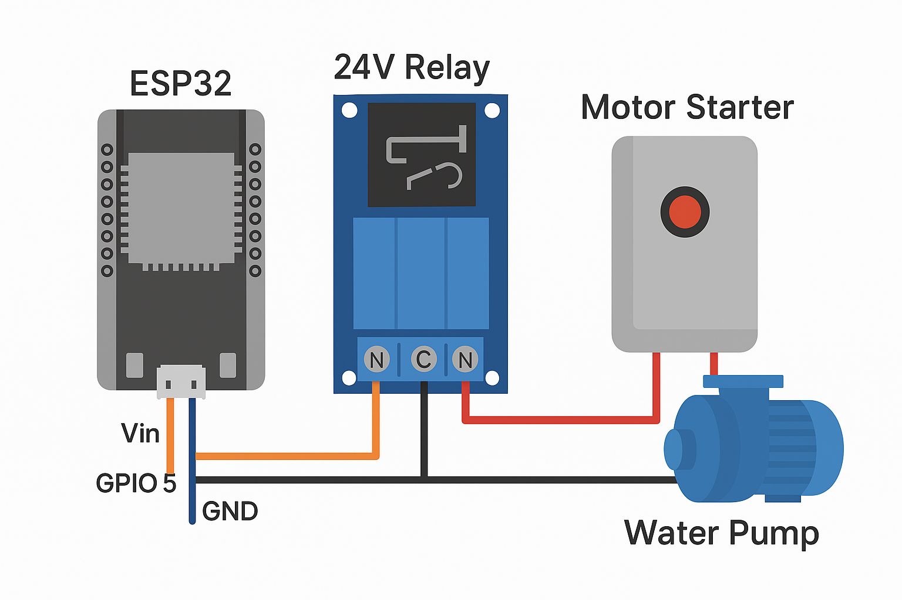

# 💧 ESP32 Water Pump Control

A secure, feature-rich ESP32-based smart water pump controller for residential or small building automation. Designed for reliability, remote access, and real-time control.

---

## 🚀 Features

- 🔒 User authentication (admin/user roles)
- ⏱️ Custom timer input (user-defined minutes)
- 🔁 Real-time motor status updates via WebSocket
- 🗂️ Tabbed log viewer:
  - Motor operation logs (14-day history)
  - Daily motor start count logs (60-day history)
- 🧠 Auto shutoff after 30 minutes
- 🧑‍💼 Admin-only user management panel (add/change roles/reset passwords)
- 🖥️ HTML panel hosted directly on ESP32
- 📱 React Native app (mobile + web)
- 🧾 Configurable inactivity logout
- 🧪 Ready for future enhancements: OTA updates + water level sensors

---


## Project Structure

```
ESP32_Water_Pump_Control/
├── README.md
├── data/
│   ├── index.html
│   └── main.js
│
├── react_native_app/
│   ├── App.js
│   └── screens/
│       ├── ControlScreen.js
│       ├── LogsScreen.js
│       └── UserManagementScreen.js
│
├── src/
│   ├── main.cpp
│   ├── Variables.h
│   ├── MotorControl.cpp / .h
│   ├── UserManagement.cpp / .h
│   ├── WebServer.cpp / .h
│   └── LogManagement.cpp / .h
```
---

## 🧪 Example Logs

### 🔧 Motor Operation Log
{
  "timestamp": "2024-03-28 07:31:20",
  "action": "Motor Started",
  "user": "admin",
  "timer_value": 15
}

### 📊 Daily Motor Start Count
{
  "date": "2024-03-28",
  "day": "Thursday",
  "start_count": 3
}

---

## 🔌 GPIO to Relay Connection Chart

| ESP32 Pin | Relay Pin | Purpose                        |
|-----------|-----------|--------------------------------|
| GPIO23    | IN        | Controls the relay (motor ON/OFF) |
| GND       | GND       | Common ground                  |
| 5V / 3.3V | VCC       | Powers relay module            |

---

## ⚡ Relay → Motor Starter Wiring

| Relay Terminal | Connects To               | Purpose                      |
|----------------|---------------------------|------------------------------|
| COM            | Live input from MCB       | Common switching terminal    |
| NO             | Motor Starter Input       | Activated when relay closes  |

✅ Relay activates → Motor starter coil energizes → Motor turns ON.

---

## 🖼️ Circuit Diagram



---

## 🌐 Remote Access Summary

### 🔐 Option 1: Port Forwarding + Dynamic DNS
- Forward external port (e.g., 8080) to ESP32's IP
- Use DuckDNS or similar to get a domain like:
  http://myhome.duckdns.org:8080

⚠️ Must protect all endpoints with login + consider HTTPS

---

### 💡 TL;DR:
- Same Wi-Fi? ✅ Works out of the box  
- Remote? Use:
  - 📡 Port forwarding
  - 🌐 VPN
  - ☁️ Cloud relay (optional)

---

## 📌 Configuration Variables (Variables.h)

```cpp
#ifndef VARIABLES_H
#define VARIABLES_H

// Relay Control
#define MOTOR_PIN 23

// Network Settings
#define IP_ADDRESS "192.168.1.100"
#define WIFI_SSID "YourWiFiName"
#define WIFI_PASSWORD "YourWiFiPassword"

// Timer Settings
#define MAX_TIMER 30  // Max timer in minutes

// Authentication
#define DEFAULT_ADMIN_USERNAME "admin"
#define DEFAULT_ADMIN_PASSWORD "password"

// Session timeout in seconds
#define INACTIVITY_TIMEOUT 300

#endif

```

---

## 🔐 Security + 🛡️ Reliability

### 🔐 Security Features

- **User Authentication**: Username/password login with token validation for all requests.
- **Role-Based Access Control**: Only admin users can manage other users or change roles/passwords.
- **Session Expiry**: Auto-logout after inactivity (default: 5 minutes), configurable.
- **WebSocket Security**: WebSocket connections are authenticated using tokens.
- **Remote Access**: If exposed to the internet via DDNS/port forwarding, all routes require login.
- **Admin Panel Protection**: Admin controls hidden from non-admin users both in UI and backend.

### 🛡️ Robustness

- **Failsafe Motor Timer**: Motor auto-stops after user-defined timer or max 30 minutes.
- **Auto Cleanup**: Logs older than 14/60 days are automatically deleted.
- **Live Sync**: Real-time countdown and status updates via WebSocket keep all devices in sync.
- **Input Validation**: Timer input and all user actions are validated before execution.
- **Modular Design**: Separated concerns make it easy to test, debug, and extend.

